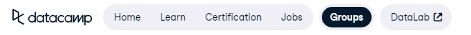
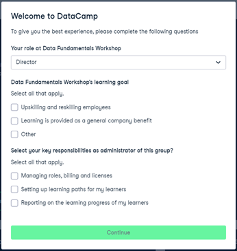
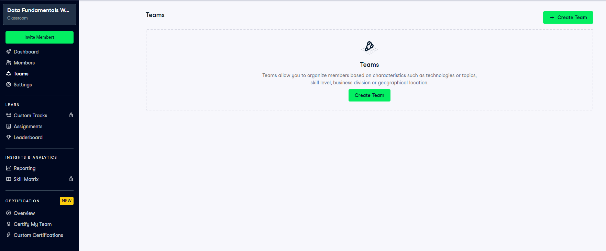
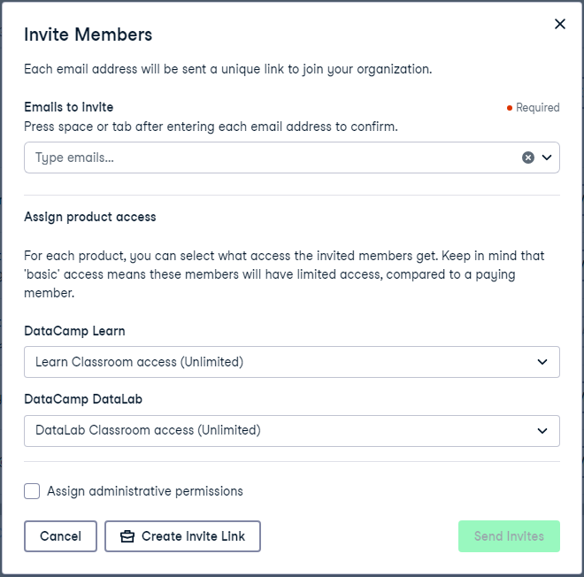
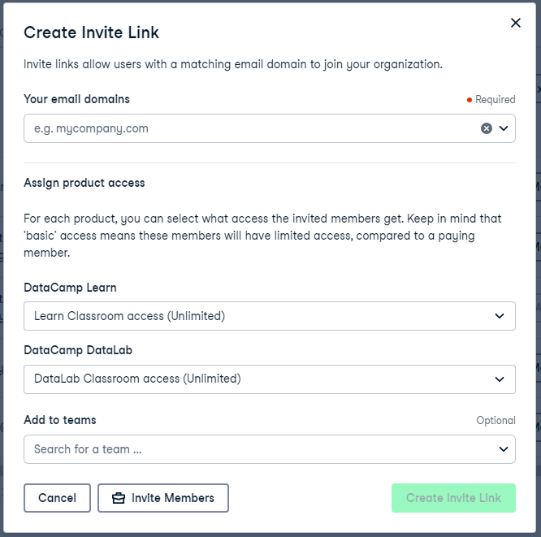
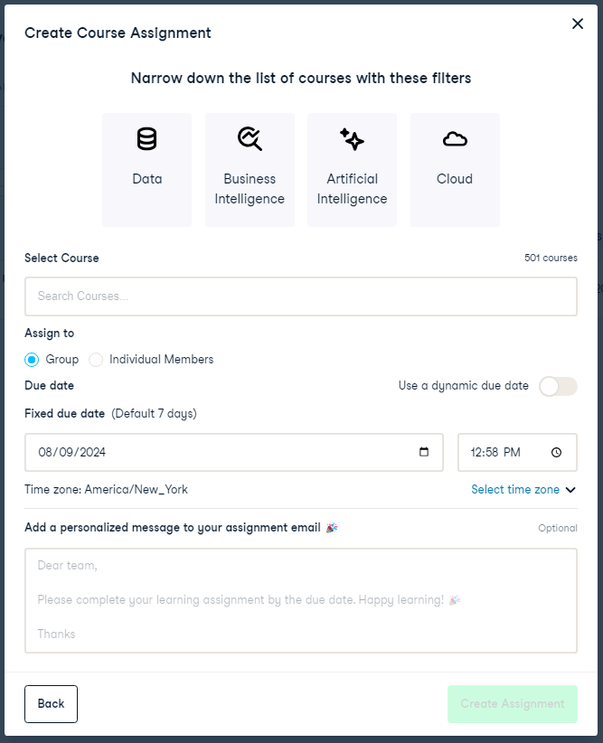

# DataCamp

DataCamp is an online learning platform that offers interactive courses and tutorials on various topics related to data science, programming, and analytics. It provides a hands-on learning experience through coding exercises and real-world projects.

DataCamp offers a comprehensive curriculum with a wide range of courses, providing educators with the flexibility to cover various data science and programming topics. The platform also offers interactive exercises, quizzes, and projects, enhancing student engagement and understanding. With the ability to track student progress and assign specific courses, DataCamp provides educators with a practical and interactive learning experience for their students.

## Table of Contents
- [Set up a Classroom](#set-up-a-classroom)
- [Teams](#teams)
- [Invite Students](#invite-students)
- [Create Assignments](#create-assignments)
- [Track Progress](#track-progress)
- [Student Experience](#student-experience)

## Set up a Classroom
DataCamp's Free Classroom for Educators program offers instructors access to DataCamp's interactive learning platform and coding platform, enabling them to integrate data science into their curriculum.

1. Fill out the form at this [link](https://www.datacamp.com/universities#classroom-form) to request a free classroom for your class. This will give you 6 months of access of the premium content with the ability to reapply. 
    Note: They may ask you verify that you're an active educator. If this is the case, you can link your BMC faculty page, i.e. [your page from the directory](https://www.brynmawr.edu/inside/people)
2. Once you gain access to your classroom, naviage to the Groups tab. If you have multiple classrooms you may need to select the classroom of interest on the Groups page, otherwise it takes you directly to your classroom dashboard. 

    

3. The first time you navigate to the classroom page a form may pop up. Fill it out accordingly. 

    

4. In the following sections, we will discuss the features included in the classroom and how to add students to this resource. 

## Teams
1. You can also create teams which allows you to split your students into groups based on the skills you'd like to teach, the students' current level, or the interests of the students. You can create a team by clicking either of the bright green button on the Teams page. 

    

2. Create a name for the team and a color to be associated with it. Then click Create Team. 

    

3. Within the Team, you can assign specific courses or invite students. More information about both of these processes can be found below. 

Why might you utilize Teams? Let's say you have students across a spectrum of experience using R. In the first class period perhaps you have them take a pre-class survey where they self-identify their skill level and comfort level with topics. Then you can create two or more groups to assign students different subsections of topics that would be most helpful to students. 

## Invite Students
1. There are several different routes to invite students. First, from the Team page, you can invite students directly to a Team. Two, in the tool bar for the classroom there should be a Members tab which will bring you to a page with all the Members. 
2. To invite members directly, you can click the bright green 'Invite Members' button which will bring up the following pop-up. In this pop-up, you can invite one or more students by listing their emails. On this page, you can also assign their type of access (you want to select Classroom) and optionally you can assign a Team for the student(s). 

    

3. To create a link that you can share with students for access, you can click the bright green 'Create Invite Link' button which will bring up the following pop-up. In this pop-up, you will need to indicate the email domain of your students (brynmawr.edu), and again you can select access type (Classroom) and optional teams. 

    

4. On the members page, you should see four tabs: All Members, Pending Invites, Waiting List, and Invite Links. Importantly, if you need to go back to a link you made to add students to the online classroom, this link can be found under the Invite Links page. 

## Create Assignments
1. Under the Assignments tab, you can create assignments either for the entire classroom or for specific groups of students. Notice that you can toggle between assignments assigned to your entire classroom versus items assigned to just a single team. 

    

2. First click the bright green 'Create Assignment' button. 
3. This will bring a pop-up where you will have to selec the type of assignment. 
    A. Course - Roughly four hours of interactive material (videos, quizzes, coding problems) on a specific topic 
    B. Chapter - A single section of a courses that should roughly 30 minutes to an hour 
    C. Assessment - Roughly 15 questions about a specific topic (allows students to test out courses as well)
    D. Certification - "Exam" type assessments which should take roughly 30 minutes to an hour on a broad skill. 
    E. Track - Roughly 20 to 30 hours of interactive material; often made up of several courses and assessments
    F. Project - A coding project designed to practice or teach a skill
    G. Earn XP - Allow students to gain points across any type of learning material
    Note: Custom Tracks are not available on the free Classroom version. 

    

4. As an example, if you were to click Course from this menu of options, it would bring up another form where you can select the options for the course you want to assign. Here you can select the specific course to assign, who it will be assigned to, a due date, and an optional message to students. 

    

## Track Progress 
You can view student progress in a number of places. 
1. Under assignments, you can view the percentage of students who have completed the assignment. 
    
    

    Under view details, you can also see which students who have started, missed, or completed the assignment. 

    

2. Under the Leaderboard tab, you can see the breakdown of students completing assignments and earning experience points (XP). 

    

3. Under the Reporting tab, you can see similar information as the leaderboard just without the ranking. 

    

## Student Experience
For the student, they only need to navigate to the Learn tab at the top of the screen to find their assignments and leaderboard. Under the Learn tab, they will see their Progress Dashboard. At the top it has the courses and tracks that are in progress, next they will find any items that are currently assigned to them, and underneath that they'll have a item that shows their 'in progress' and 'completed' courses. 

Students will also be able to see the Leaderboard. In the case of using Teams, they will only see their ranking against other people on their Team. 

Finally, students will have a dashboard of all their assignments. Note here there's an assignment that is just to their Team (R Learners) and one that's assigned to everyone. There's no indication for the student whether an assignment is assigned to a team or to everyone except based on who assigned it. 

